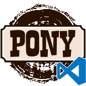

# Ponylang extension README



This extension provides basic support for Pony language in vscode.

## Features

* Syntax highlighting (based on grammar definition from https://github.com/ponylang/sublime-pony)

* Problem matcher, which parses ponyc output to highlight errors in editor

## Example build task

You have to declare problem matcher in your tasks.json. See example below:
```json
{
    "version": "2.0.0",
    "tasks": [
        {
            "label": "build debug",
            "group": "build",
            "type": "shell",
            "options": {
                "cwd": "${fileDirname}",
            },
            "command": "ponyc --debug -o bin",
            "problemMatcher": "$ponyc-matcher"
        }
    ]
}
```


